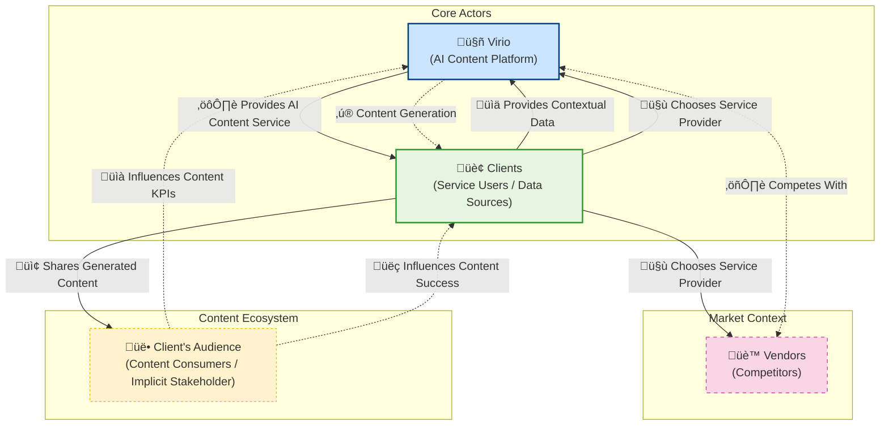

# Overview

What it means to be human is immutable. What changes over time is the social context in which these traits exist. Data drift is innevitable and thus, we must build a dynamical system that is capable of evolving over time to combat data drift, while simultaneously keeping its core features grounded in the human elements.

## To DO

- [] Convert Reach & Engagement Metrics over to their own subsections and add entity diagrams for each
- [] Add interpretability sections across all metrics and provide business use-case examples
- [] Incorporate the entity diagram for data aggregation & storage, with icons for integrations
- [] Develop user stories to showcase how the memory interface can be customized via groupings of tribal personas
- [] Practice the elevator pitch for these concepts and consider converting these to a video presentation --feed info on silver platter.

## Table of Contents

Completed sections are marked with a ✅.

- [Assignment](#assignment)
  - [Foundational Concepts & Goal Setting](#foundational-concepts--goal-setting-relates-to-background--overall-task-goal)
  - [Task Question 1: KPIs for "High Quality Content"](#task-question-1-kpis-for-high-quality-content)
  - [Task Question 2: The Best Memory Interface](#task-question-2-the-best-memory-interface)
  - [Task Question 3: Viral Content Black Box & Data Shape](#task-question-3-viral-content-black-box--data-shape)
  - [Task Question 4: Other Data Sources Needed](#task-question-4-other-data-sources-needed)
  - [Task Question 5: System Design & Endpoints](#task-question-5-system-design--endpoints)
  - [Bonus Thought Exercises](#bonus-thought-exercises)
- [Action Plan & Prioritization](#action-plan--prioritization)
  - ✅ [Tier 1: Highest Priority / Critical Path Foundation](#tier-1-highest-priority--critical-path-foundation)
  - [Tier 2: High Priority / Core Mechanism Design](#tier-2-high-priority--core-mechanism-design-dependent-on-tier-1)
  - [Tier 3: Medium Priority / Logistics & Feasibility](#tier-3-medium-priority--logistics--feasibility)
  - [Additional Required Action Items](#additional-required-action-items)
- [Stakeholder Map](#stakeholder-map)
- [Stakeholder Analysis](#stakeholder-analysis)
  - [Key Stakeholders](#key-stakeholders)
    - [Virio](#virio)
    - [Clients](#clients)
    - [Vendors (Competitors)](#vendors-competitors)
    - [Client's Audience](#clients-audience)
  - [Key Relationships](#key-relationships)
    - [Virio ⟷ Clients](#virio--clients)
    - [Virio ⟷ Vendors](#virio--vendors)
    - [Clients ⟷ Vendors](#clients--vendors)
    - [Clients ⟷ Audience](#clients--audience)
    - [Audience ⟷ Virio (Indirect)](#audience--virio-indirect)
  - [Implications for System Design](#implications-for-system-design)
- [Success Metrics and KPIs](#success-metrics-and-kpis)
  - [Virio-Facing Metrics](#virio-facing-metrics)
    - [Data Moat Performance](#data-moat-performance)
    - [Business Performance](#business-performance)
    - [Content Quality Differentiation](#content-quality-differentiation)
    - [Operational Efficiency](#operational-efficiency)
  - [Client-Facing Metrics](#client-facing-metrics)
    - [Reach & Engagement Metrics](#reach--engagement-metrics)
    - ✅ [Structural Virality Metrics](#structural-virality-metrics)
      - ✅ [Cascade Size](#cascade-size-popularityvolume)
      - ✅ [Structural Virality (Wiener Index)](#structural-virality-wiener-index)
      - ✅ [Cascade Depth](#cascade-depth)
      - ✅ [Cascade Breadth](#cascade-breadth)
      - ✅ [Branching Factor](#branching-factor)
    - [Temporal Dynamics](#temporal-dynamics)

## Assignment

### Foundational Concepts & Goal Setting (Relates to Background & Overall Task Goal)

- **Core Goal:** Build and preserve data moat.

- **Preservation:** What does preserving the moat mean? Preventing erosion? Is an immutable moat possible? Intuition tells me a data moat will be ever-changing as data drift is a reality.

- **Defining Success:** A secure data moat doesn't automatically guarantee the desired success. Need to define what success looks like. Make it measurable!

- **Context Acquisitons:** Need to get context from clients via provided sources. How can you incentivize clients to share context? Will it be enough to simply provide the product or service in exchange for it, or will there need to be some concrete financial gain (e.g. getting paid for their data sharing).

- **Stakeholder Identification:** Crucial to map out who the entities are. Get the current list of stakeholders (e.g. client, vendors) and conert it into an entity diagram using Mermaid

### Task Question 1: KPIs for "High Quality Content"

- **Central Tension:** "High quality" content (authentic, human) v.s. "Addictive content" (metrics-drive, potentially negative/divisive) seem diametrically opposed. Dig deeper into what makes high quality content v.s. addictive content. I believe there might be a way to strike a balance between the two  by creating healthy addictions that result in mutually beneficial outcomes for both parties.

- **The "Addictive" Driver:** Often thought of as negative/divisive content. These perform well algorithmically by tapping into human tribalism (in groups v.s. out-groups). This makes sense when thought of through the lens of multi-armed bandit algorithms. If you occasionally show divisive content, then it drives users into a state of action in the form of comments. Comments are valuable data generated byusers, but these also double up as signal sending. These signals are what allow people to be "binned" into their respective groups/tribes via an algorithmic interpretation. The multi-armed bandit algorithm also have novelty and discovery mechanisms baked into it which simualtes the hunt and gambling to some extent. I'll need to investigate a re-imagining of the multi-armed bandit algorithm that produces more ideal outcomes for the maximal amount of stakeholders.

- **Proposed "High Quality" Metrics - Novelty:** Novelty/out-of-distribution (or in the tails) content sit at the intersection of human and agent interest. These should be weighted heavily to combat generic, formulaic outputs (think anit-Marvel fatigue). In the bonus there's talk about whether or not what humans are interested in will diverge from agents. This is both `yes` and `no`. They will `not diverge` in that they will both gravitate towards novel content, but they `will diverge` in tersm of what tribes that they gravitate towards. This implies that we'll need a 1-1 mapping between groups and distinct agents. In order for agents to mimic the flow of human online behavior, we'll need to characterize different tribes and then tune the agents to these tribal personas. **The discovery of such tribes can be achieved by using well-known clustering algorithms** The agents we build can then be fine-tuned based on the data corresponding to each groups distribution of post/comments content. Doing this will make agents more compatible with the assumptions made by the multi-armed-bandit algorithm. Scoring a single particular user or agent to measure which tribe they best fit into can be determined by some combination of the clustering algorithms themselves or a simple cosine similarity of a vector embedding.

- **Engagement Mechanism - Randomness/Discovery:** The addictive nature of casinos(random rewards) is relevant. Novelty stimulates discovery, analogous to hunter-gatherer rewards. Multi-armed-bandit algorithms partially address this, but I think it can be dramatically improved upon. some of the ways this can be done is by playing with the frequency at which random novel information comes in, as well as speeding up feedback loop experiences for the end user.

- **Moral Dilemma:** Optimiing for virality/attention (good for business) might mean manipulating primal nature, potentially harming mental health. This ties back into exploring methods in which we can maximize beneficial outcomes or strike some kind of balance between stakeholders. Additionally, challenge the black box idea. It's operating under the assumption that the current algorithms for viral content is the best version available. However, what if the reason that those parameters are such good predictors of success is due to those being how the underlying system is designed? There may exist a healthier and more fulfulling way to do this. After all, it is the system that promotes what content gets pushed to the masses. We need to counterbalance this idea with the fact that corporations have invested massive resources into the behavioral psychology of what makes their products so addictive.

### Task Question 2: The Best Memory Interface

- **Conceptual Interpretation:** Think of a memory interface like something sitting between consciousness and past experiences. It acts as a contract, dictating how communication occurs and what each component can expect from the other.

- **Alignment with Code Interfaces:** This concept strongly aligns with programming inferfaces --defining interaction rules without specifying implementation.

- **Granularity:** At what level should this inferface exist?

    - Between code components (e.g. classes)?
    - Between systems/microservices?
    - Humans as interfaces (e.g, bridging LLMs and PM requirements)?

- **Implementation Options (from original prommpt):**

    - Fine-tuning one model per client (digital clone approach)?
        - I believe this ones isn't feasible, at least in the early stages.

    - Relying on large context windows in advanced transformerss?
        - I'm thinking this can be best handled with a well-engineeered RAG system

### Task Question 3: Viral Content Black Box & Data Shape

- **Need for Novelty Data:** The black box providing viral content/data should likely highlight novelty or out-of-distribution elements with a greater weighting, as this connects both to both avoid generic content and driving engagement. This have overlap with KPI

### Task Question 4: Other Data Sources Needed*

- **Potential Client Data Srouces:** 
    - Slide decks
    - Excel sheets
    - Call transcripts (Zoom, etc.)
    - Existing content(social media posts, blog articles, videos)
    - Acces to other AI assistants used by the client?
    - Client's social/professional connections (potentially modeled visuallly):
        - As a graph
        - As an adjacendy list (if sparse)
        - As a matrix (if dense)
    
- **Data Dynamics:** Explore the concept of a "steady state" for client data -- does their core voice/style stabilize, or is it constantly evolving? Investigate how platforms like character.ai do things, and whether or not they provide tooling that can be integrated or leveraged in our solutions

### Task Question 5: System Design & Endpoints

- **Core Components:**

    - Ingests the right data
    - Transforms it into the right shapes

- **Ingestion Considerations:**

    - **Identification Mechanism:** How do we identify the "right" data? this depeonds on how we measure and characterize data types (potentially linking back to personas/tribes)

    - **Method:** Use web crawlers? Driect API access? File uploads?

- **Transformation Considerations:**

    - **Data Shape:** What does "right shape" mean?
        - Dimensionality (e.g. for vevtor embeddings)?
        - Attributes/Features (metadata, extracted concepts)?
        - Both?

- **Storage & Accessibility:**

    - What is the best way to store the processed data (vector DB, graph DB, relational DB)?

    - What speed of accessibility is needed? Real-time for generation? Bathc processing acceptable for some update?

- **Endpoints (As specified in prompt):**

    - `POST /script` (Payload: transcript -> engaging, authentic video script)
    - `POST /text` (Payload: transcript -> engaging, authentic text post)
    - Need to thin about how the ingested/transformed data informs thse endpoints

### Bonus Thought Exercises

- **Agent v.s. Human Viwership:** 

    - Agents' "interests" will differ from humans', except regarding novelty. Both will be drawn to novelty.

    - Agents will diverge from humans on the deeply human/primal/evolutionary themse (reporduction, resource acquisiton, tribalism) - (Unless agents are specifically tuned to mimic these tribal personas)

    - **Agent Viewership Dominance:** They might dominate? Its hard to say, but I don't think there will be a runaway growth of this. It will be counter-balanced by the decreasing returns on investment. Think predator-prey population dynamics equations, where there's a "carrying capacity". Its not in companies best interest to kill the system.

    - **Future of B2B Content:** Didn't think too deeply on this one.

## Action Plan & Prioritization

### Tier 1: Highest Priority / Critical Path Foundation

- ✅ **Determine Stakeholder Relationships (C):**  
  Acquire descriptors for each entity (client, vendor, etc.) and build a visual mapping of these relations.  
  *Rationale:* Understanding who the system serves and their relationships is foundational before defining success or KPIs meaningfully.  
  *Critical Path:* Needed before defining success/KPIs accurately.  
  *Impact:* High (Ensures relevance).

- ✅ **Create Success Metrics (A):**  
  Define what overall success looks like for Virio with this system (client retention, market differentiation, specific growth targets).  
  *Rationale:* This defines the ultimate goal that the specific content KPIs should serve.  
  *Critical Path:* Needed before detailed KPI definition.  
  *Impact:* High (Sets overall direction).

- ✅ **Define High Quality vs. Addictive Content Metrics (D):**  
  Create tangible measures backed by research papers, including at least one paper on casino psychology.  
  *Rationale:* Directly tackles the core problem of measuring "authenticity, character, heart" versus mere engagement metrics.  
  *Critical Path:* Must be done before designing mechanisms that aim to achieve these qualities.  
  *Impact:* Highest (Directly addresses the core challenge).

### Tier 2: High Priority / Core Mechanism Design (Dependent on Tier 1)

This tier was not acted upon, since these will come at the latter stages of the project. For now, I believe the focus
should be on the Tier 1 items and simplistic modeling and metrics --we need to learn to walk before we can run.

- **Characterize Tribal Personas (F):**  
  Use clustering algorithms and vector embeddings to identify and characterize tribes, then tune agents to mimic these tribal personas.  
  *Rationale:* Core methodology for achieving personalization and balancing quality/engagement.  
  *Depends on:* Definition of Quality/Addictive KPIs (D).  
  *Impact:* High (Core mechanism for personalization/differentiation).

- **Engineer Tribe Identification Mechanisms (H):**  
  Implement technical details for clustering & cosine similarity methods.  
  *Rationale:* Technical implementation of action item F.  
  *Depends on:* Initial Tribe Characterization (F), Definition of Quality/Addictive KPIs (D).  
  *Impact:* High (Execution of the core mechanism).

- **Adapt Multi-Armed Bandit Algorithm (E):**  
  Examine if the algorithm can be tweaked for greater flexibility to meet our requirements.  
  *Rationale:* Explores algorithmic approach for balancing exploration (novelty) and exploitation (known engagement).  
  *Depends on:* Definition of Quality/Addictive KPIs (D), potentially initial Tribe concepts (F).  
  *Impact:* Medium-High (Specific technical approach, effectiveness TBD).

- **Improve MAB Algorithm (G):**  
  Brainstorm ways to enhance the algorithm and its degrees of freedom while maintaining balance.  
  *Rationale:* Refinement step for the MAB approach.  
  *Depends on:* Initial MAB exploration (E), Definition of Quality/Addictive KPIs (D).  
  *Impact:* Medium-High (Refinement of technical approach).

### Tier 3: Medium Priority / Logistics & Feasibility

- **Evaluate Data Sharing Incentives (B):**  
  Determine if product access is sufficient in exchange for data, or if financial incentives are needed.  
  *Rationale:* Crucial for implementation and data acquisition strategy, but conceptual design can proceed before this is answered.  
  *Impact:* Medium (High for feasibility, lower for initial conceptual design).

### Additional Required Action Items

- **Formalize Required Data Sources:**  
  Create comprehensive list of client-provided and external data sources with specific formats.  
  *Depends on:* Stakeholder Relationships (C), Quality Metrics (D), and Tribal Personas (F).

- **Design Memory Interface:**  
  Choose and design specific memory interface approach (fine-tuning vs. large context vs. hybrid).  
  *Depends on:* Quality Metrics (D), Tribal Personas (F), and Required Data Sources.

- **Develop System Architecture:**  
  Design overall data flow, storage solutions (vector DBs), transformation steps, and API endpoint logic.  
  *Integrates:* Results from most other tasks.

- **Define Viral Content Requirements:**  
  Explicitly define the required shape and type of data needed from the viral content black box.

## Stakeholder Map



## Stakeholder Analysis

### Key Stakeholders

#### Virio
- **Role:** The company developing the AI content generation system, serving as the primary actor building and leveraging the "data moat" to create high-quality, personalized content.
- **Goals:** 
  - Differentiate from competitors by excelling at creating content with "character, authenticity, heart"
  - Build and maintain a proprietary data advantage (the "moat")
  - Develop systems resilient to data drift while preserving human elements
  - Attract and retain clients through superior content quality

#### Clients
- **Role:** Users of Virio's service who need personalized, authentic content generation.
- **Goals:**
  - Receive high-quality, engaging content that authentically represents their voice
  - Build their own brand and effectively connect with their audience
  - Minimize time spent on content creation while maximizing quality
  - Achieve measurable success with their content (engagement, conversion, etc.)
- **Value:** The primary source of unique contextual data Virio needs for its data moat

#### Vendors (Competitors)
- **Role:** Alternative solutions in the market that offer similar content creation services.
- **Goals:**
  - Attract clients from the same target market as Virio
  - Develop competitive features and capabilities
  - Potentially build their own data advantages
- **Significance:** Serve as benchmarks against which Virio measures its differentiation strategy

#### Client's Audience
- **Role:** The ultimate consumers of the generated content; implicit stakeholders who don't directly interact with Virio.
- **Goals:**
  - Consume relevant, authentic, and engaging content
  - Connect with the client's brand or message
- **Impact:** Their reception and engagement with content ultimately determines success metrics and influences Virio's approach

### Key Relationships

#### Virio ⟷ Clients
- **Service Provision:** Virio provides AI-powered content generation tailored to each client's unique voice and needs
- **Data Exchange:** Clients provide essential contextual data (transcripts, presentations, existing content) that powers Virio's personalization capabilities
- **Trust Dynamic:** The relationship depends on client willingness to share sensitive contextual data in exchange for high-quality outputs
- **Value Proposition:** A key tension exists around whether the service itself is sufficient compensation for client data, or if additional financial incentives are needed
- **Selection Criteria:** Clients choose Virio based on content quality, authenticity, and effectiveness compared to alternatives

#### Virio ⟷ Vendors
- **Competitive Positioning:** Virio aims to outperform competitors by focusing on "human" elements of content that traditional AI might miss
- **Differentiation Strategy:** The "data moat" serves as a key competitive advantage, allowing Virio to offer more personalized and authentic content
- **Market Dynamics:** Competition drives innovation in metrics, algorithms, and approaches to content generation
- **Client Acquisition:** Both Virio and Vendors compete for the same client base, necessitating clear value differentiation

#### Clients ⟷ Vendors
- **Service Selection:** Clients have choice between Virio and competitor offerings
- **Switching Costs:** Potential friction in moving between services based on data already shared and relationships built
- **Value Assessment:** Clients evaluate services based on quality, cost, authenticity, and measured effectiveness

#### Clients ⟷ Audience
- **Content Distribution:** Clients share Virio-generated content with their audience
- **Brand Representation:** The content must authentically represent the client's brand and voice
- **Success Measurement:** Audience engagement directly impacts the client's perception of Virio's value
- **Feedback Loop:** Audience reactions inform future content needs and refinements

#### Audience ⟷ Virio (Indirect)
- **Quality Assessment:** Audience engagement metrics (watch time, shares, comments) indirectly measure Virio's content quality
- **Content Evolution:** Audience preferences and reactions influence Virio's content algorithms and approaches
- **KPI Impact:** The audience's perception of authenticity and engagement with content shapes how Virio defines "high quality"

### Implications for System Design

- **Data Collection Strategy:** Must prioritize obtaining rich, contextual data from clients while respecting privacy and providing clear value exchange
- **Personalization Depth:** The system should leverage client data to create truly distinctive content that captures their unique voice
- **Feedback Integration:** Audience metrics must flow back to inform content generation approaches
- **Competitive Awareness:** System should continuously benchmark against competitor capabilities
- **Trust Building:** Design must emphasize security, privacy, and transparent value to encourage client data sharing
- **Differentiation Focus:** All system components should enhance the human-like, authentic qualities that distinguish Virio from competitors

## Success Metrics and KPIs

### Virio-Facing Metrics

#### Data Moat Performance

- **Data Uniqueness Score:** Measures how distinctive Virio's client data is compared to publicly available data
  $DUS = 1 - \frac{1}{|C|}\sum_{c \in C}\text{sim}(E_c, E_{pub})$
  where $C$ is the set of clients, $E_c$ is client embeddings, and $E_{pub}$ is public data embeddings

- **Context Richness Index:** Quantifies the depth and breadth of contextual data collected per client
  $CRI = \frac{1}{|C|}\sum_{c \in C}\sum_{d \in D_c} w_d \cdot q_d$
  where $D_c$ is client c's data sources, $w_d$ is source weight, and $q_d$ is data quality score

- **Data Drift Resilience:** Measures system's ability to maintain performance despite evolving data
  $DDR = 1 - \frac{|\text{Perf}_{t} - \text{Perf}_{t-1}|}{|\Delta\text{Data}|}$
  where $\text{Perf}_t$ is performance at time t and $\Delta\text{Data}$ is the data change magnitude

- **Moat Preservation Rate:** Tracks retention of valuable client data over time
  $MPR = \frac{|C_{\text{retained}}|}{|C_{\text{total}}|} \times \frac{\sum_{c \in C_{\text{retained}}} V_c}{\sum_{c \in C_{\text{total}}} V_c}$
  where $C_{\text{retained}}$ is retained clients and $V_c$ is client data value

#### Business Performance

- **Client Acquisition Rate:** Rate of new client acquisition over time
  $CAR = \frac{|C_{t}| - |C_{t-1}|}{|C_{t-1}|} \times 100\%$
  where $C_t$ is the set of clients at time $t$

- **Client Retention Rate:** Percentage of clients who continue using Virio's services
  $CRR = \frac{|C_{t} \cap C_{t-1}|}{|C_{t-1}|} \times 100\%$
  where $C_t$ is the set of clients at time $t$

- **Client Lifetime Value:** Expected revenue from a client throughout their relationship
  $CLV = \sum_{t=0}^{n} \frac{R_t - C_t}{(1+d)^t}$
  where $R_t$ is revenue, $C_t$ is cost at time $t$, and $d$ is discount rate

- **Market Share Growth:** Rate of market share increase relative to competitors
  $MSG = \frac{MS_t - MS_{t-1}}{MS_{t-1}} \times 100\%$
  where $MS_t$ is market share at time $t$

#### Content Quality Differentiation

- **Authenticity Score:** Measure of how authentic content appears compared to human-written
  $AS = \frac{1}{|S|}\sum_{s \in S} P(H|s)$
  where $S$ is set of generated samples and $P(H|s)$ is probability human judges think sample $s$ is human-written

- **Client Voice Fidelity:** Similarity between generated content and client's voice/style
  $CVF = \frac{1}{|C|}\sum_{c \in C}\text{sim}(E_{gen,c}, E_{orig,c})$
  where $E_{gen,c}$ is embedding of generated content and $E_{orig,c}$ is client's original content

- **Novelty Index:** Measures uniqueness of generated content compared to existing content
  $NI = 1 - \max_{e \in E_{existing}}\text{sim}(e, E_{generated})$
  where $E_{existing}$ is set of existing content embeddings and $E_{generated}$ is new content

- **Quality-to-Engagement Ratio:** Balances content quality with engagement metrics
  $QER = \alpha \cdot AS + (1-\alpha) \cdot ER$
  where $AS$ is authenticity score, $ER$ is engagement rate, and $\alpha$ is weighting factor

#### Operational Efficiency

- **Content Generation Throughput:** Volume of content generated per unit time
  $CGT = \frac{|C_{gen}|}{T}$
  where $C_{gen}$ is content generated and $T$ is time period

- **Adaptation Speed:** Time required to adapt to new client or data source
  $AS = T_{effective} - T_{onboarding}$
  where $T_{effective}$ is when performance reaches target and $T_{onboarding}$ is start time

- **Resource Efficiency:** Content quality relative to computational resources used
  $RE = \frac{AS}{R_{compute}}$
  where $AS$ is authenticity score and $R_{compute}$ is compute resources consumed

- **Cost per Effective Content:** Cost to produce content that achieves target engagement
  $CPEC = \frac{C_{total}}{|C_{effective}|}$
  where $C_{total}$ is total cost and $C_{effective}$ is content meeting quality thresholds

### Client-Facing Metrics

#### Reach & Engagement Metrics

- **Reach:** Total number of unique users who see content
  $R = |\{u \in U : \text{viewed}(u, c)\}|$ 
  where $U$ is the set of all users and $c$ is the content

- **Impressions:** Total views including repeat views
  $I = \sum_{u \in U} \text{views}(u, c)$

- **Engagement Rate:** Percentage of users who engage with content after viewing
  $ER = \frac{\text{Number of engagements}}{\text{Number of impressions}} \times 100\%$

- **Share Rate / Amplification Rate:** Ratio of shares to impressions
  $SR = \frac{\text{Number of shares}}{\text{Number of impressions}} \times 100\%$

- **Virality Rate:** Measure of secondary audience reach through sharing
  $VR = \frac{\text{Secondary impressions}}{\text{Primary impressions}}$

- **Click-through Rate (CTR):** Percentage of users who click after viewing
  $CTR = \frac{\text{Number of clicks}}{\text{Number of impressions}} \times 100\%$

- **Follower Growth Rate:** Rate of follower increase during a campaign
  $FGR = \frac{F_t - F_{t-1}}{F_{t-1}} \times 100\%$ 
  where $F_t$ is followers at time $t$

- **Mention / Social Share of Voice:** Brand mentions relative to competitors
  $SSOV = \frac{\text{Brand mentions}}{\text{Total industry mentions}} \times 100\%$

#### Structural Virality Metrics

#### Cascade Size (Popularity/Volume)

**Visualization Concept:** Complete Network Spread

Total number of users in sharing cascade: $CS = |V|$ where $V$ is the set of users in the cascade


**Key Features:**
- Node count = Total cascase size
- All nodes and connections visible
- Simple count display (e.g. "Cascade Size: 11 users reached")
- Color-coded by level
- Continuous / Dynamic updates as cascade grows

#### Structural Virality (Wiener Index) 🤣

**Visualization Concept:** Path Distance Heatmap

Average distance between all node pairs
  $W = \frac{1}{|V|(|V|-1)} \sum_{i \in V}\sum_{j \in V, j \neq i} d(i,j)$ 
  where $d(i,j)$ is the shortest path from node $i$ to $j$


**Key Features:**
- Color intensity based on average path length from origin
- Path distances labeled on edges
- Numerical Weiner index displayed (e.g. "Structural Virality: 2.5")
- Visual comparison to broadcast v.s. viral diffusion patterns shown as smal reference icons.

#### Cascade Depth

**Visualization Concept:** Longest Path Highlight

Maximum path length in sharing tree
  $CD = \max_{i \in V} d(r, i)$ 
  where $r$ is the root node and $d(r,i)$ is distance from root to node $i$


**Key Features:**
- Highlighte longest path from origin to furthest reshare
- Depth count displayed (e.g. "Cascade Depth: 4 levels")
- Non-path nodes shown in muted colors
- Optional depth level labels


#### Cascade Breadth

**Visualization Concept:** Level width emphasis

Maximum number of shares at any depth level
  $CB = \max_{l \in L} |N_l|$ 
  where $L$ is the set of levels and $N_l$ is nodes at level $l$


**Key Features:**
- Nodes arranged in clear horizontal levels
- Highlighted level with maximum width
- Width count displayed for each level
- Maximum breadth emphasized (e.g. "Cascade Breadth: 6 at level 2")

#### Branching Factor

**Visualization Concept:** Node Outgoing Connection Visualization

Average number of shares per user
  $BF = \frac{|E|}{|V|-1}$ 
  where $E$ is the set of edges (shares) and $V$ is the set of vertices (users)

  ```mermaid
graph TD
    A[Original Post<br>BF=3.0] --> B1[Share 1<br>BF=2.0]
    A --> B2[Share 2<br>BF=1.0]
    A --> B3[Share 3<br>BF=3.0]
    B1 --> C1[Re-share 1.1<br>BF=0]
    B1 --> C2[Re-share 1.2<br>BF=0]
    B2 --> C3[Re-share 2.1<br>BF=0]
    B3 --> C4[Re-share 3.1<br>BF=0]
    B3 --> C5[Re-share 3.2<br>BF=0]
    B3 --> C6[Re-share 3.3<br>BF=1.0]
    C6 --> D1[Re-share 3.3.1<br>BF=0]
    
    classDef noBranch fill:#ddd,stroke:#333,stroke-width:1px;
    classDef lowBranch fill:#afa,stroke:#333,stroke-width:1px;
    classDef medBranch fill:#ffa,stroke:#333,stroke-width:1px;
    classDef highBranch fill:#f96,stroke:#333,stroke-width:2px;
    
    class A highBranch;
    class B3 highBranch;
    class B1 medBranch;
    class B2,C6 lowBranch;
    class C1,C2,C3,C4,C5,D1 noBranch;
  ```

**Key Features:**
- Node size proportional to branching factor (outgoing edges)
- Branching factor labeled on each node
- Color intensity based on branching factor
- Average branching factor displayed prominently (e.g. "Average Branching Factor: 1.2")

All of these metrics can be incorporated into a comprehensive dashboard that provides a holistic view of the cascade's structure and dynamics. It can include:

1. A primary combined visualization showing
  - The complete cascase network
  - Interactive toggles to highlight each metrics
  - A time slider to show cascade development over time

2. A side panel with:
  - Numerical values for each metric
  - Interpretations of what each value means in terms of cascade structure and virality
  - Benchmarks against industry averages or competitors

#### Temporal Dynamics

#### Reach Velocity / Diffusion Speed

Rate of growth in unique viewers over time
  $RV = \frac{dR}{dt}$ or discretely $RV = \frac{R_t - R_{t-1}}{\Delta t}$

#### Cascade Lifetime

Duration from content creation to last significant engagement
  $CL = t_{last} - t_{0}$ 
  where $t_0$ is start time and $t_{last}$ is time of last engagement

#### Time to Reach Viral Target

Time to reach a predefined virality threshold
  $TVT = \min\{t : R_t \geq R_{target}\}$

#### Peak Time

Time to reach maximum engagement rate
  $PT = \text{argmax}_t ER_t$ 
  where $ER_t$ is engagement rate at time $t$


#### Inter-Event Time (IET)

Average time between consecutive engagements
  $IET = \frac{1}{n-1}\sum_{i=1}^{n-1}(t_{i+1} - t_i)$ 
  where $t_i$ is time of $i$-th engagement

---

#### Content Consumption Metrics

#### Watch Time

Total time users spend consuming content
  $WT = \sum_{i \in V} d_i$
  where $V$ is the set of all views and $d_i$ is the duration of view $i$


**Key Features:**
- Total accumulated hours watched across all content
- Breakdown by individual content pieces
- Comparison to previous time periods
- Correlation with platform algorithm boost metrics

#### Average View Duration

Average time a viewer spends consuming a piece of content
  $AVD = \frac{\sum_{i \in V} d_i}{|V|}$
  where $V$ is the set of all views and $d_i$ is the duration of view $i$


**Key Features:**
- Average watch time prominently displayed
- Visual representation of viewer drop-off points
- Key moments of increased or decreased retention highlighted
- Comparison against industry benchmarks

#### Retention Rate

Percentage of content watched before users drop off
  $RR(t) = \frac{|V_t|}{|V_0|} \times 100\%$
  where $V_0$ is the initial number of viewers and $V_t$ is viewers at time $t$


**Key Features:**
- Segment-by-segment retention analysis
- Identification of significant drop-off points
- Color-coded performance indicators
- Content structure overlay showing relationship between content segments and retention

#### Conversion Rate

Actions taken post-viewing, such as sign-ups or purchases
  $CR = \frac{\text{Number of conversions}}{\text{Number of views}} \times 100\%$


**Key Features:**
- Complete conversion funnel visualization
- Step-by-step drop-off analysis
- Overall conversion rate calculation
- Comparison to industry benchmarks
- Identification of largest drop-off points for optimization
